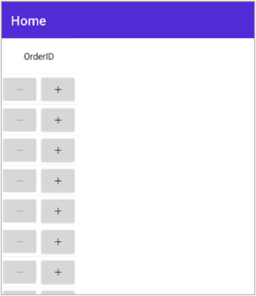

# Create a Custom DataGridColumn in MAUI DataGrid
In.NET [MAUI DataGrid](https://www.syncfusion.com/maui-controls/maui-datagrid) (SfDataGrid) allows you to create custom [DataGridColumn](https://help.syncfusion.com/cr/maui/Syncfusion.Maui.DataGrid.DataGridColumn.html) by following the below steps.

**Step 1** - To create a custom column, you must inherit from the DataGridColumn class and specify the [DataGridColumn.CellType](https://help.syncfusion.com/cr/maui/Syncfusion.Maui.DataGrid.DataGridColumn.html#Syncfusion_Maui_DataGrid_DataGridColumn_CellType) property.

**Step 2** -	A Custom [CellRenderer](https://help.syncfusion.com/cr/maui/Syncfusion.Maui.DataGrid.SfDataGrid.html#Syncfusion_Maui_DataGrid_SfDataGrid_CellRenderers) cclass must be created for the custom column by customizing the  [DataGridCellRenderer<D, E>](https://help.syncfusion.com/cr/maui/Syncfusion.Maui.DataGrid.DataGridCellRenderer-2.html).

**Step 3** -	In the created cell renderer class, you should override the following methods.
	[OnCreateDisplayUIView()](https://help.syncfusion.com/cr/maui/Syncfusion.Maui.DataGrid.DataGridCellRenderer-2.html#Syncfusion_Maui_DataGrid_DataGridCellRenderer_2_OnCreateDisplayUIView) – Generate the data to be placed in the grid cell.
     [OnInitializeDisplayView()](https://help.syncfusion.com/cr/maui/Syncfusion.Maui.DataGrid.DataGridCellRenderer-2.html#Syncfusion_Maui_DataGrid_DataGridCellRenderer_2_OnInitializeDisplayView_Syncfusion_Maui_DataGrid_DataColumnBase__0_) – To set up the cell content loaded in the grid cell with the necessary settings.
 

**Step 4** -	You must add the custom column to the  [SfDataGrid.Columns](https://help.syncfusion.com/cr/maui/Syncfusion.Maui.DataGrid.SfDataGrid.html#Syncfusion_Maui_DataGrid_SfDataGrid_Columns) collection and its renderer to  [SfDataGrid.CellRenderers](https://help.syncfusion.com/cr/maui/Syncfusion.Maui.DataGrid.SfDataGrid.html#Syncfusion_Maui_DataGrid_SfDataGrid_CellRenderers) collection.

For example, refer the below example in which a custom column is created for loading a Stepper control in the grid columns. A custom renderer class is written to load Stepper control as display.

## XAML
```XAML
<syncfusion:SfDataGrid x:Name="dataGrid"  
                           ItemsSource="{Binding Employees}"       
                           ColumnWidthMode="Auto"
                           AutoGenerateColumnsMode="None">
        <syncfusion:SfDataGrid.Columns>
            <local:StepperColumn MappingName="OrderID"/>
        </syncfusion:SfDataGrid.Columns>
</syncfusion:SfDataGrid>

```

## C#
### Creating Stepper Column
```C#
public class StepperColumn : DataGridColumn
{
    public StepperColumn()
    {
        var cellType = typeof(DataGridColumn).GetRuntimeProperties().FirstOrDefault((property) => property.Name == "CellType");
        cellType.SetValue(this, "Stepper");
    }
}
```
### Custom cell renderer for StepperColumn
```C#

public class StepperColumnRenderer : DataGridCellRenderer<Stepper, Stepper>
{
    public StepperColumnRenderer()
    {
    }

    protected override Stepper OnCreateDisplayUIView()
    {
        return new Stepper();
    }
}
```
### MainPage
```C#
public partial class MainPage : ContentPage
{
    
    public MainPage()
    {
        InitializeComponent();
        dataGrid.CellRenderers.Add("Stepper", new StepperColumnRenderer());
    }	
}
```

## Conclusion
I hope you enjoyed learning about how to create custom DataGridColumn in MAUI DataGrid (SfDataGrid).

You can refer to our [.NET MAUI DataGrid’s feature tour](https://www.syncfusion.com/maui-controls/maui-datagrid) page to know about its other groundbreaking feature representations. You can also explore our .NET MAUI DataGrid Documentation to understand how to present and manipulate data.
For current customers, you can check out our .NET MAUI components from the [License and Downloads](https://www.syncfusion.com/account/downloads) page. If you are new to Syncfusion, you can try our 30-day free trial to check out our .NET MAUI DataGrid and other .NET MAUI components.
If you have any queries or require clarifications, please let us know in comments below. You can also contact us through our [support forums](https://www.syncfusion.com/forums), [Direct-Trac](https://support.syncfusion.com/account/login?ReturnUrl=%2Faccount%2Fconnect%2Fauthorize%2Fcallback%3Fclient_id%3Dc54e52f3eb3cde0c3f20474f1bc179ed%26redirect_uri%3Dhttps%253A%252F%252Fsupport.syncfusion.com%252Fagent%252Flogincallback%26response_type%3Dcode%26scope%3Dopenid%2520profile%2520agent.api%2520integration.api%2520offline_access%2520kb.api%26state%3D8db41f98953a4d9ba40407b150ad4cf2%26code_challenge%3DvwHoT64z2h21eP_A9g7JWtr3vp3iPrvSjfh5hN5C7IE%26code_challenge_method%3DS256%26response_mode%3Dquery) or [feedback portal](https://www.syncfusion.com/feedback/maui?control=sfdatagrid). We are always happy to assist you!